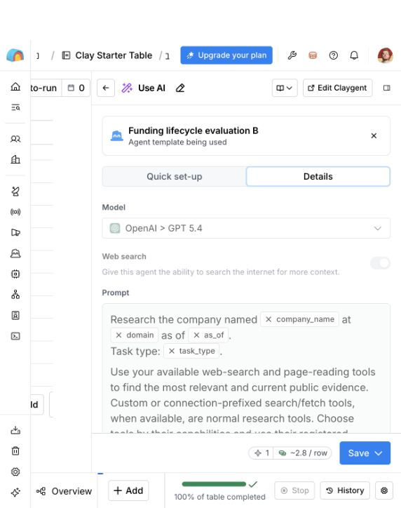

# Keenable Eval for Claygent

[Clay](https://www.clay.com/) enriches customer data. [Claygent](https://university.clay.com/docs/claygent-builder) researches companies using web search.



*Adding the experiment’s saved Claygent as a Clay column. Shown before saving or running.*

This experiment tests whether [Keenable](https://keenable.ai/) improves answers about the latest funding and current ownership status.

50 companies, three conditions, GPT-5.4. The task comes from [dated user reports](docs/evidence.md).

- **A:** native Clay search.
- **B:** the same prompt, with Keenable available.
- **C:** native research followed by an explicit Keenable verification step.

## Results

**Keenable with explicit verification prompting improved results.**

All 150 answers completed and were reviewed against sources on September 30, 2026.

| | A: native | B: optional Keenable | C: prompted verification |
| --- | ---: | ---: | ---: |
| Companies with all target facts correct and supported | **38/47** | **39/47** | **42/47** |
| Runs that used Keenable | 0/50 | 10/50 | 49/50 |
| Clay data credits | 176.5 | 206.2 | 207.3 |
| Clay action credits | 50 | 50 | 50 |

Two companies (MangoBoost and Abridge) have unresolved latest-funding evidence and remain unscored. The separate Freeman entity probe passed in all three conditions. Excluding Keenable itself gives 37/46, 38/46 and 41/46. Scores cover preselected target facts, not every claim in an answer.

**Concrete benefit:** C used Keenable to retrieve a [Lessn disclosure](https://www.ad-hoc-news.de/boerse/news/unternehmensnachrichten/sydney-au-mar-3-2026-acn-newswire-accounts-payable-automation/68628893) of a $300,000 investment in November 2025. A/B stopped at the earlier August round.

**Limits:** all conditions missed later extensions for ElevenLabs and Harvey. All four B field-score wins occurred without using Keenable. C changed the prompt, so its overall improvement is not an isolated search-provider effect. [Case findings and remaining errors](docs/methodology.md#result-interpretation).

[All company results](runs/comparison/results.md) · [Scores and sources](runs/comparison/judgments.json) · [Retrieval audit](evidence/retrieval-audit.json)

Seven C attempts failed during MCP initialization, with zero reported credits. Each was retried once; all attempts are preserved. The 150 answers consumed 590 data credits and 150 actions, excluding setup smoke tests.

## How to run

Use Docker with Compose. Python and the official Clay CLI are pinned in the image.

### Reproduce saved results

```sh
git clone https://github.com/Alpus/clay-keenable-eval.git
cd clay-keenable-eval
docker compose build
CLAY_NETWORK_MODE=none docker compose run --rm eval reproduce --output /results/comparison
```

After the image is built, this runs without network access, credentials or credits. It recalculates metrics from saved answers and reviewed judgments.

### Run a fresh comparison

Follow the [three setup and run steps](docs/usage.md#fresh-comparison-with-docker). Clay authorization and a one-time Builder connection are required; the script creates the agents and runs A/B, then C. Fresh runs spend existing Clay credits. New factual scores require source review.

The default is **30 concurrent runs**, with starts spaced by two seconds. Repeat a run command to resume without repeating completed answers.

## Details

All three conditions have native web search. B may choose Keenable; C is instructed to use it for gaps, conflicts and freshness checks. C was added after inspecting A/B and tests a changed research strategy, not a pure search-engine substitution. Tool-step summaries show actual use but truncate many response bodies. This is a purposive exploratory sample, not a representative benchmark.

[Method and scoring](docs/methodology.md) · [Complaint evidence](docs/evidence.md) · [Setup and resume](docs/usage.md)

`eval` is the only runner. `cases.json` contains agent inputs; `ground-truth.json` contains separate reference facts. `prompt.txt`, `prompt-verify.txt` and `output-schema.json` define the agents. Saved runs contain configurations, answers, traces, charges and judgments. Credentials are excluded.
